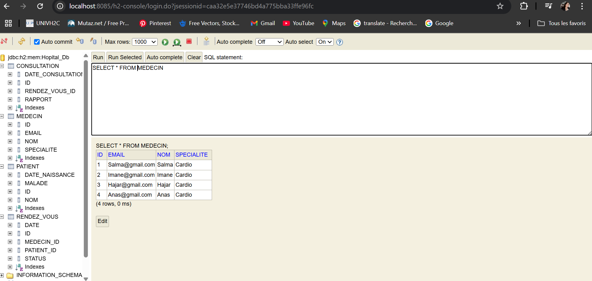
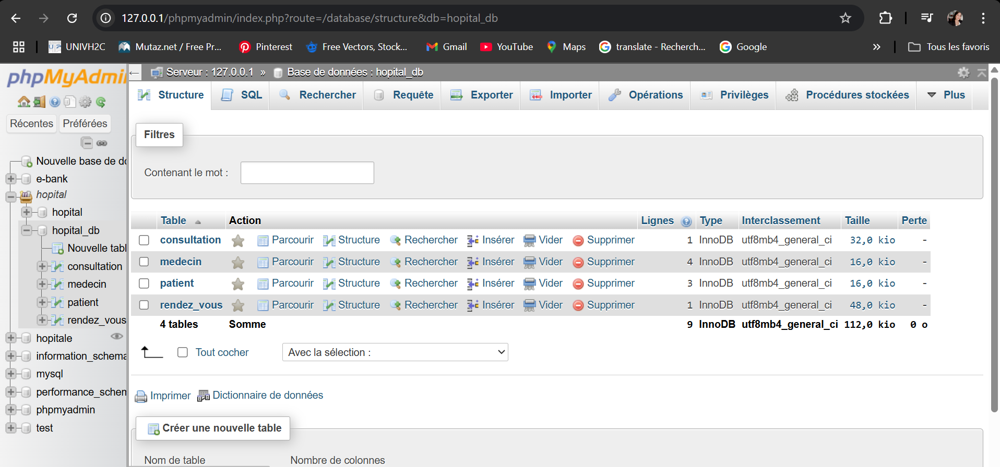
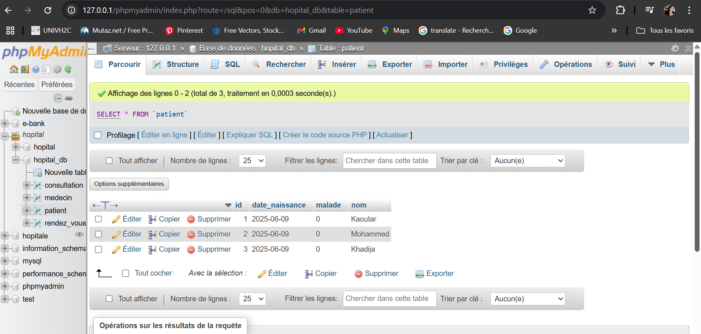

## Application de Gestion d’Hôpital avec Spring Boot et JPA
Dans cette application, nous avons conçu un système de gestion d’hôpital afin de mettre en évidence
le concept de mapping objet-relationnel (ORM) en utilisant Spring Data JPA et son implémentation par défaut : Hibernate.

## Création du Projet
Nous avons créé un projet Spring Boot avec les dépendances suivantes :

Spring Data JPA

Spring Web

H2 Database

Lombok

## Captures des differents partie de l'application

Nous pouvons voir la base de donnees h2 qui a ete cree saisissant dans le navigateur http://localhost:8085/h2-console/

### Migration de H2 vers MySQL

## Intégration d’une Couche Web
Nous avons ajouté une couche web avec des contrôleurs REST afin de visualiser les données via le navigateur.
Par exemple, en accédant à http://localhost:8085/patients, nous obtenons la liste des patients :

# Auteur
Salma FENNAN

